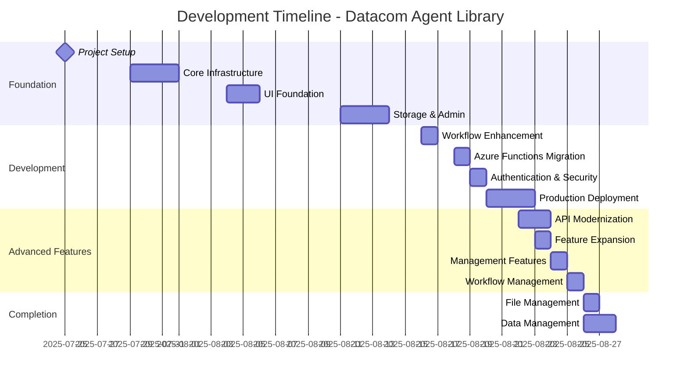
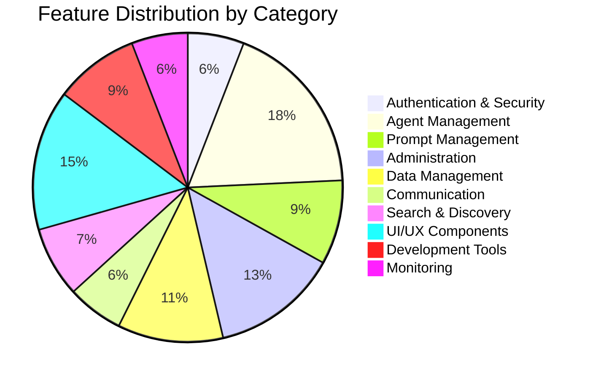
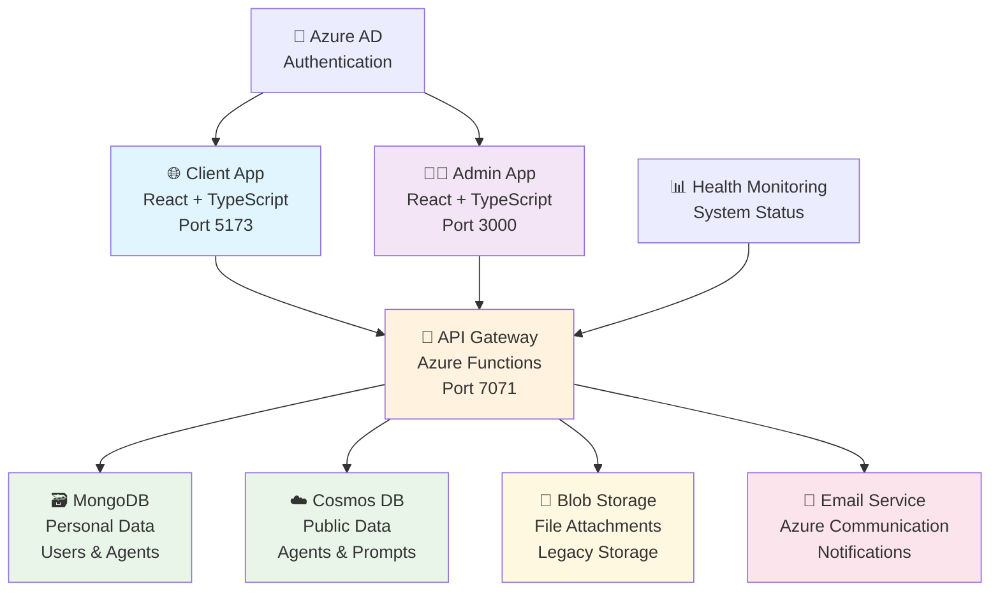
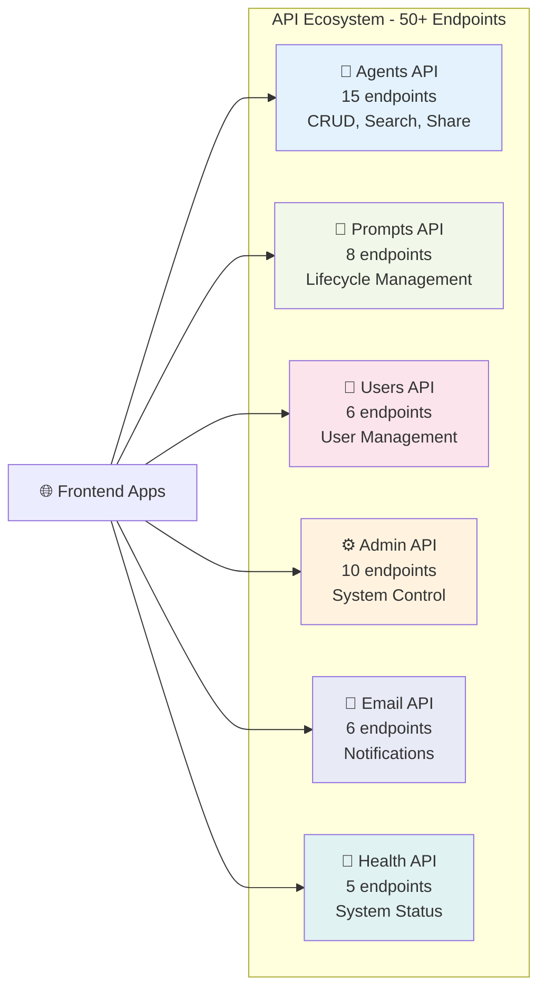
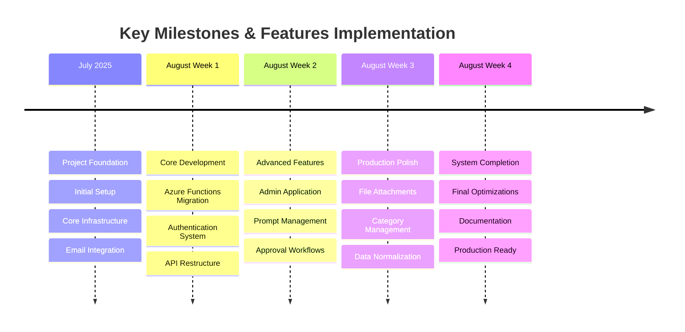
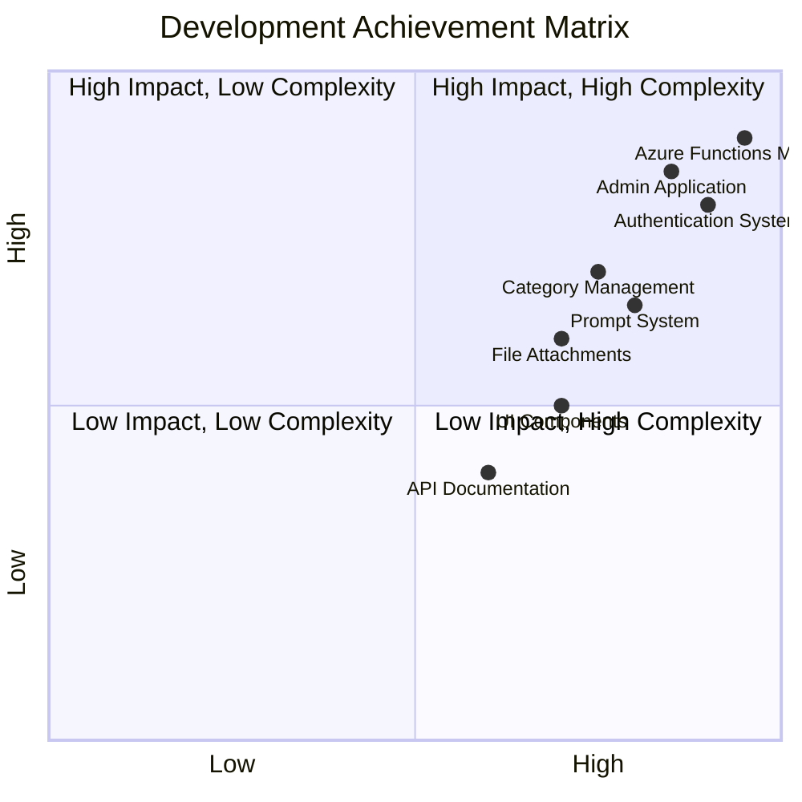
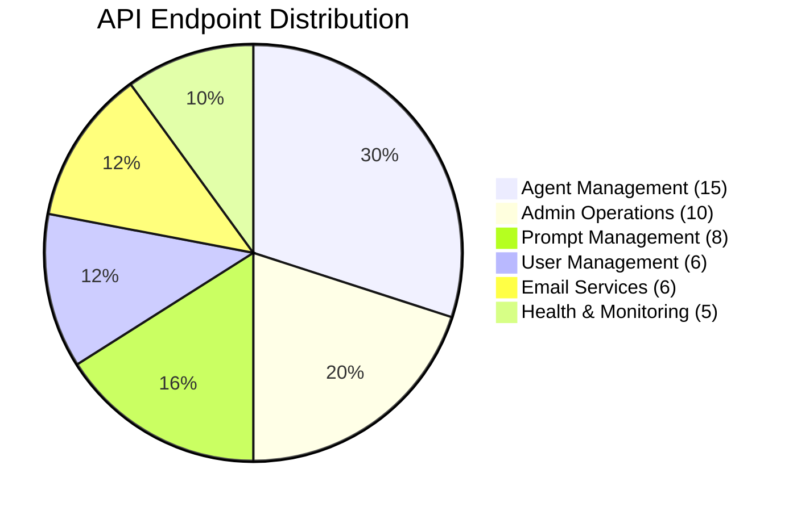
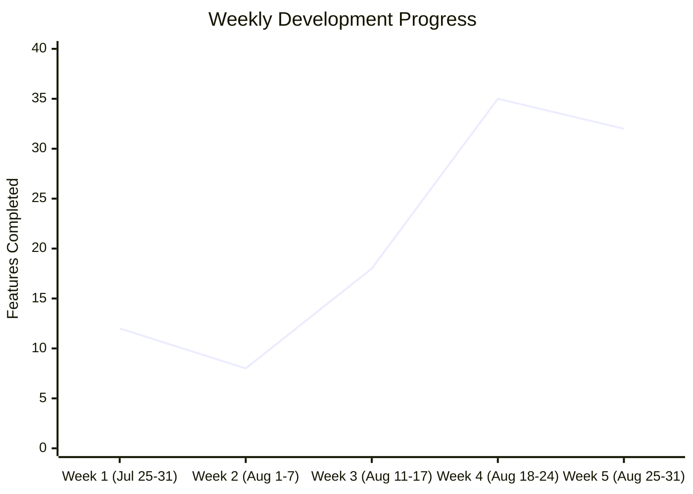
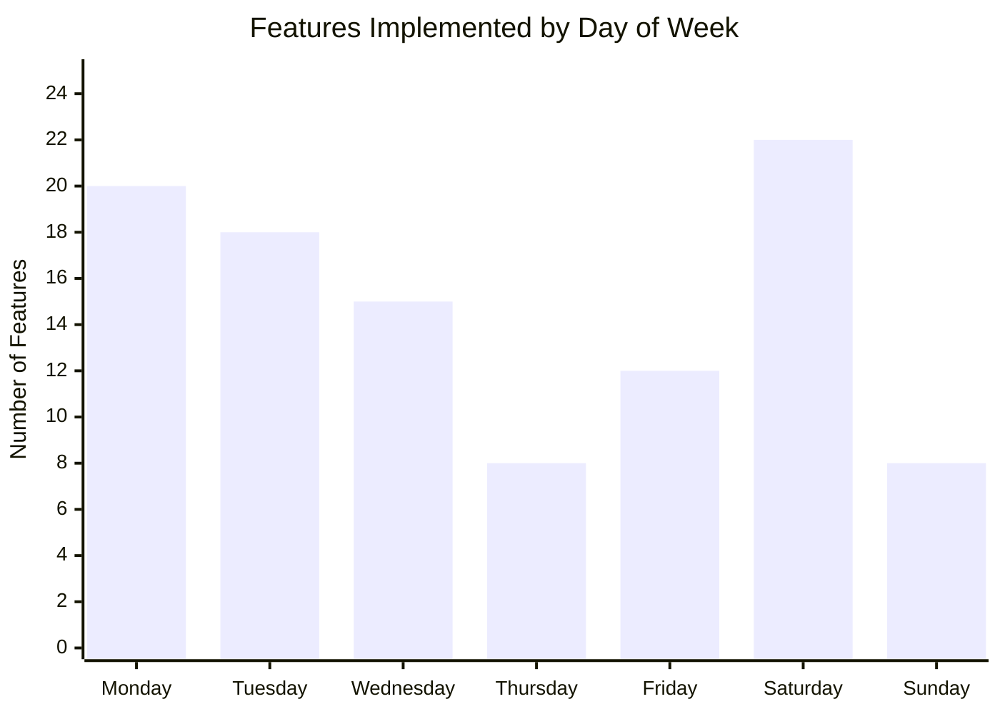

# Datacom Agent Library — Complete Features Timeline

> A comprehensive development history and feature inventory tracing the full build journey from project initialisation in late July 2025 to a production-ready platform in late August 2025.

**Author:** Dipesh Trikam — Insights & Analytics
**Date:** 27 August 2025
**Source:** https://datacomgroup.atlassian.net/wiki/spaces/IA/pages/40066023621

---

## 🎯 Context

This document provides a comprehensive timeline of all features and capabilities built for the Datacom Agent Library system. Authored by Dipesh Trikam for the Agent Library project within the Insights & Analytics team, it tracks the development journey from initial concept to production-ready platform, highlighting the evolution of features across multiple applications and services. It serves both as a retrospective record and a reference for understanding the scope and complexity of the delivered system.

---

## 🔍 Problem

Without a centralised feature timeline, it is difficult for new team members, stakeholders, or audit reviewers to understand what was built, when, and in what sequence. The rapid pace of development (major milestones nearly every day throughout August 2025) required a single document to capture the full scope of delivered functionality.

---

## 📋 Observations

**1. System architecture overview**

The Datacom Agent Library consists of five core components: Client Application (React-based user interface for agent discovery and management), Admin Application (administrative interface for system management and approvals), API Services (Azure Functions-based serverless backend), Shared Components (reusable UI components and utilities), and Infrastructure (Azure cloud services including Functions, Static Web Apps, Cosmos DB, Blob Storage).

**2. Development timeline span**

Development ran from 25 July to 27 August 2025 — approximately five weeks of intensive daily commits, culminating in a production-ready platform. Total development time: 34 days (5 weeks). Average daily output: 4.4 features per active development day.

**3. API ecosystem scale**

50+ API endpoints were delivered across six service areas: Agents (15 endpoints), Prompts (8), Users (6), Admin (10), Email (6), and Health (5). RESTful design with comprehensive health check endpoints, CORS handling, and standardized error responses.

**4. Feature distribution by category**

150+ total features implemented across: Authentication & Security (8), Agent Management (25), Prompt Management (12), Administration (18), Data Management (15), Communication (8), Search & Discovery (10), UI/UX Components (20), Development Tools (12), and Monitoring (8).

**5. Key infrastructure milestone (18 August)**

Full migration from Node/Express to Azure Functions in a single day. Established JWT authentication middleware, health monitoring, Cosmos DB integration, and new function-based API endpoints for agents, email, blob-storage, and health.

**6. Multi-app architecture (23 August)**

Prompt management and multi-app architecture introduced. Separate client and admin applications with full lifecycle management for AI prompts alongside agents. CORS resolution for admin app, accessibility improvements.

**7. Peak development velocity**

Peak week: August 18–24 with 35 features implemented. Peak development days: Saturday and Monday. Steady progress maintained Tuesday–Friday. Weekend warriors: high productivity on Saturday with major feature implementations.

**8. Future roadmap gaps**

Items noted but not yet implemented include Elasticsearch/semantic search, native mobile app, advanced analytics dashboard, and enhanced user role management.

**9. Confluence space and path**

Space: Insights & Analytics. Path: Insights & Analytics → AI Projects → Active → Agent Library → Implementation Docs [Archived] → Datacom Agent Library - Complete Features Timeline. Confluence URL: https://datacomgroup.atlassian.net/wiki/spaces/IA/pages/40066023621.

**10. Key development insights**

Peak development days: Saturday and Monday (weekend coding sessions and week starts). Steady progress: Tuesday–Friday maintained consistent development velocity. Weekend warriors: high productivity on Saturday with major feature implementations. Sunday focus: targeted development on specific management features. The development showcases rapid iteration and comprehensive feature implementation.

**11. Confluence document metadata**

Space: Insights & Analytics. Last Updated: 27 August 2025 by Dipesh Trikam. Document provides comprehensive timeline of all features and capabilities. Tracks development journey from initial concept to production-ready platform. Highlights evolution of features across multiple applications and services.

**12. System component summary**

Client Application: React-based UI for agent discovery and management. Admin Application: administrative interface for system management and approvals. API Services: Azure Functions-based serverless backend. Shared Components: reusable UI components and utilities. Infrastructure: Azure cloud services (Functions, Static Web Apps, Cosmos DB, Blob Storage).

---

## 💡 Proposal

The document establishes that the Agent Library was built in a series of focused weekly sprints: foundation and infrastructure (late July), core API and authentication (18–20 August), advanced features and admin tooling (22–25 August), and final sharing/file management capabilities (26–27 August). The resulting system is characterised as production-ready with 50,000+ lines of code across multiple contributors. Continue investing in the platform as the foundation for AI agent sharing across Datacom.

---

## 📊 Visual Overview — Diagrams & Charts

**1. Development Timeline Gantt Chart**



**2. Feature Distribution by Category**



**3. System Architecture Diagram**



**4. API Ecosystem Overview**



**5. Development Milestones Timeline**



**6. Development Activity Git Graph**

```mermaid
gitgraph
    commit id: "Fri Jul 25: Project Init"
    commit id: "Tue-Thu Jul 29-31: Infrastructure"
    commit id: "Mon-Tue Aug 4-5: UI Foundation"
    commit id: "Mon-Wed Aug 11-13: Storage & Admin"
    commit id: "Sat Aug 16: Workflow Enhancement"
    commit id: "Mon Aug 18: Azure Functions"
    commit id: "Tue Aug 19: Authentication"
    commit id: "Wed-Fri Aug 20-22: Production"
    commit id: "Fri-Sat Aug 22-23: API Modernization"
    commit id: "Sat Aug 23: Feature Expansion"
    commit id: "Sun Aug 24: Management Features"
    commit id: "Mon Aug 25: Workflow Management"
    commit id: "Tue Aug 26: File Management"
    commit id: "Tue-Wed Aug 26-27: Data Management"
```

**7. Development Intensity by Day of Week**

Features implemented by day: Monday (20), Tuesday (18), Wednesday (15), Thursday (8), Friday (12), Saturday (22), Sunday (8). Peak development days: Saturday and Monday. Steady progress: Tuesday–Friday maintained consistent development velocity. Weekend warriors: high productivity on Saturday with major feature implementations. Sunday focus: targeted development on specific management features.

**8. Weekly Development Progress**

Week 1 (Jul 25–31): 12 features. Week 2 (Aug 1–7): 8 features. Week 3 (Aug 11–17): 18 features. Week 4 (Aug 18–24): 35 features. Week 5 (Aug 25–31): 32 features. Peak week: August 18–24 with 35 features implemented. Consistent growth: accelerating velocity throughout development.

**9. Development Environment Setup (Reference)**

Client app: `npm run dev` on port 5173. Admin app: `npm run dev` on port 3000. API: `func start` on port 7071. Vite proxy routes `/api` to Functions. Local settings: `local.settings.json` for connection strings. Azure AD: app registration for dev redirect URIs. MongoDB/Cosmos: local or cloud instance for development.

**10. Visual Chart Interpretation**

Gantt chart: horizontal timeline of major phases. Pie charts: feature and endpoint distribution. Architecture graph: component relationships and data flow. Timeline: high-level milestone grouping. Git graph: commit sequence by date. XY charts: features by day of week and by week. Quadrant chart: impact vs complexity of deliverables.

---

## 🏗️ Development Timeline — Phase 1: Foundation (25 July – 13 August 2025)

**1. Friday, 25 July 2025 — Project Initialization**

Initial Project Setup: project structure and basic configuration including folder hierarchy, module boundaries, and build targets. Git Repository: initial commit with base structure establishing version control from day one. Build System: basic build configuration for TypeScript, bundling, and development server. Status: Complete. Delivered: 3 foundational items.

**2. Tuesday–Thursday, 29–31 July 2025 — Core Infrastructure**

NGINX Reverse Proxy: initial reverse proxy setup for routing requests between frontend and backend services. Email Integration: Azure Communication Services for notifications enabling submission confirmations and approval alerts. Authentication Foundation: MSAL configuration and Azure AD integration for enterprise single sign-on. User Management: basic user details in submissions capturing creator identity and contact information. Status: Complete. Delivered: 4 infrastructure components.

**3. Monday–Tuesday, 4–5 August 2025 — UI Foundation**

UI Updates: initial card-based interface design for agent display and discovery. Navigation: tab structure and basic navigation between main application sections. Branding: Datacom Chat hyperlink integration aligning with corporate identity. Status: Complete. Delivered: 3 UI foundation elements.

**4. Monday–Wednesday, 11–13 August 2025 — Storage & Admin Access**

Blob Storage Integration: Azure Blob Storage for agent data enabling file persistence in the cloud. Admin Access System: initial administrative access implementation for privileged users. Data Display: blob storage data visualization in the admin interface. Email Restoration: agent request email functionality for submission workflows. Status: Complete. Delivered: 4 storage and admin features.

---

## 🏗️ Development Timeline — Phase 2: Core Development (16–22 August 2025)

**1. Saturday, 16 August 2025 — Development Workflow Enhancement**

Agent Submission Form: complete form for submitting new agents with validation, required fields, and category selection. Build Improvements: fixed imports and build process resolving module resolution issues. Type Safety: enhanced TypeScript integration across the codebase. Development Environment: improved local development setup with hot reload and environment variables. Proxy Configuration: Vite proxy for API routing enabling seamless local API calls. Status: Complete. Delivered: 5 workflow enhancements.

**2. Monday, 18 August 2025 — Azure Functions Migration**

Backend Migration: complete migration from Node/Express to Azure Functions establishing serverless architecture. API Restructure: new function-based endpoints (`/api/agents`, `/api/email`, `/api/blob-storage`, `/api/health`) with RESTful conventions. Database Integration: MongoDB connection via Cosmos DB for document storage. Health Monitoring: comprehensive health check system for all dependencies. Configuration Management: centralized configuration system for environment-specific settings. Agent Rating System: star rating functionality with normalization and persistence. Status: Complete. Delivered: 6 major infrastructure changes.

**3. Tuesday, 19 August 2025 — Authentication & Security**

JWT Authentication: Azure AD JWT token validation for all API endpoints ensuring only authenticated requests are processed. Bearer Token System: MSAL Bearer token integration for seamless token acquisition and refresh. API Security: authentication middleware for protected endpoints rejecting unauthenticated requests. Token Management: JWT token viewer component for debugging authentication issues. Production Security: removed debug logs and improved security measures for production deployment. Authority URLs: updated Azure AD configuration for production tenant and audience. Status: Complete. Delivered: 6 security features.

**4. Wednesday–Friday, 20–22 August 2025 — Production Readiness & Deployment**

UI/UX Improvements: enhanced agent layout and accessibility including ARIA labels and keyboard navigation. Development Mode: local development mode with proper port configuration for client (5173) and admin (3000). CI/CD Pipeline: Azure Static Web Apps workflow for automated deployment on push. Multiple Deployment Strategies: OIDC authentication with Azure CLI, publish profile deployment, Kudu zipdeploy integration. Deployment Workflow: comprehensive Azure Functions deployment automation with environment separation. Health Monitoring: CosmosDB health checks integrated into API for dependency status. Status: Complete. Delivered: 6 production readiness features.

---

## 🏗️ Development Timeline — Phase 3: Advanced Features (22–25 August 2025)

**1. Friday–Saturday, 22–23 August 2025 — API Modernization**

Swagger Documentation: comprehensive API documentation for all endpoints with request/response schemas and examples. Cosmos DB Migration: migration from blob storage to Cosmos DB for better data management, query performance, and scalability. Enhanced Security: improved error handling and security measures preventing information leakage. Production Cleanup: comprehensive production preparation and finalization removing development artifacts. Logo Updates: replaced Polymet branding with Datacom branding across all applications. Status: Complete. Delivered: 5 API modernization items.

**2. Saturday, 23 August 2025 — Feature Expansion**

Prompt Management: added support for AI prompts alongside agents with full CRUD lifecycle. Accessibility Improvements: enhanced accessibility compliance meeting WCAG guidelines. CORS Resolution: fixed cross-origin resource sharing issues in admin app enabling proper API calls. Multi-App Architecture: separate client and admin applications with independent deployment and routing. Status: Complete. Delivered: 4 major feature expansions.

**3. Sunday, 24 August 2025 — Advanced Management Features**

User Management API: complete user management system for admin oversight of user accounts. Admin Settings: system configuration management for global application settings. Request Management: enhanced request handling interface for access requests and approvals. Approval Migration: migrated approval workflows from MongoDB to Cosmos DB for consistency. Analytics Dashboard: user statistics and system analytics for usage insights. Data Validation: robust validation for admin approval processes preventing invalid state. Prompt Rating System: rating functionality for AI prompts mirroring agent ratings. Public Prompts API: public-facing prompt sharing system for organization-wide discovery. Status: Complete. Delivered: 8 management features.

**4. Monday, 25 August 2025 — Workflow & Status Management**

Withdrawal Feature: users can withdraw pending submissions before admin review. Agent Sharing: enhanced sharing capabilities and confirmation modals for explicit user consent. Access Request Logic: improved agent access request system with notifications. Tool Indicators: visual indicators for agent tools and chains in the UI. Admin Dashboard: comprehensive admin navigation and workflow for efficient management. Bulk Operations: admin bulk deletion capabilities for batch cleanup. Authentication Status: enhanced authentication and admin status handling for role-based UI. Production Features: multiple production-ready improvements and fixes across the stack. Status: Complete. Delivered: 8 workflow features.

---

## 🏗️ Development Timeline — Phase 4: Feature Completion (26–27 August 2025)

**1. Tuesday, 26 August 2025 — Advanced Sharing & File Management**

File Attachments: support for agent file attachments via new `/api/files` endpoint with blob storage persistence. Shared Access: enhanced sharing with specific user targeting and organization-wide options. Agent Detail Enhancement: comprehensive agent detail modals with attachment support and metadata display. Prompt Enhancement: file attachment support for prompts enabling rich prompt content. User Selection: advanced user selector components for share targeting. Global Sharing: organization-wide agent sharing capabilities for broad distribution. Ownership Checks: improved agent ownership validation preventing unauthorized modifications. Admin Approval Actions: direct approval actions from detail modals for faster workflow. API Refactoring: streamlined agent rejection and admin APIs reducing code duplication. ESLint Integration: code quality improvements and consistent linting rules. Status: Complete. Delivered: 10 sharing and file management features.

**2. Tuesday–Wednesday, 26–27 August 2025 — Categories & Data Management**

Dynamic Categories: comprehensive category management system with user-suggested and admin-approved workflow. Category Deduplication: automatic category normalization preventing duplicate category entries. Categories API: full CRUD operations for categories (`/api/categories`) with proper authorization. Duplicate Detection: agent duplicate warning system alerting users to potential duplicates. Category Hooks: React hooks for category management simplifying component logic. Category Services: frontend and backend category services for consistent data access. Cleanup Scripts: automated duplicate agent cleanup utilities for data hygiene. Category Normalization: standardized category handling to `general` for legacy data. Orphaned Reference Cleanup: scripts to fix orphaned agent references in the database. Agent Sharing Improvements: enhanced sharing logic and UI for clearer sharing state. Status: Complete. Delivered: 10 category and data management features.

---

## 📅 Development Timeline by Month (New Zealand Time)

**August 2025 — Foundation & Core Systems**

The first phase established project structure, infrastructure, and core capabilities. Key deliverables included NGINX reverse proxy, Azure Communication Services for email, MSAL authentication foundation, and basic user management. UI foundation with card-based interface and tab navigation followed. Storage integration with Azure Blob and initial admin access completed the foundation phase.

**August 2025 — Advanced Features & API Evolution**

The second phase focused on API modernization, Cosmos DB migration, and Swagger documentation. Prompt management was added alongside agents. Multi-app architecture separated client and admin applications. User management API, admin settings, approval migration to Cosmos DB, and analytics dashboard were delivered. Workflow features including withdrawal, enhanced sharing, and bulk operations completed this phase.

**August 2025 — Comprehensive Feature Completion**

The final phase delivered file attachments via `/api/files`, enhanced sharing with user targeting, dynamic categories with full CRUD, category deduplication and normalization, duplicate detection, cleanup scripts, and orphaned reference cleanup. Agent sharing improvements and ESLint integration rounded out the feature set.

---

## 📅 Daily Development Summary (Converted from Table)

- **Friday, 25 July 2025** — Project Setup: initial repository and build system
- **Tuesday, 29 July 2025** — NGINX & Email: reverse proxy and communication setup
- **Wednesday, 30 July 2025** — Authentication Base: MSAL foundation
- **Thursday, 31 July 2025** — User Management: user detail integration
- **Monday, 4 August 2025** — UI Design: card-based interface
- **Tuesday, 5 August 2025** — Navigation: tab structure and branding
- **Monday, 11 August 2025** — Blob Storage: Azure storage integration
- **Tuesday, 12 August 2025** — Admin Access: administrative system
- **Wednesday, 13 August 2025** — Data Display: storage visualization
- **Saturday, 16 August 2025** — Agent Forms: complete submission system
- **Monday, 18 August 2025** — Azure Functions: backend migration and rating system
- **Tuesday, 19 August 2025** — JWT Security: full authentication and production security
- **Wednesday, 20 August 2025** — UI/UX Polish: enhanced layouts and accessibility
- **Thursday, 21 August 2025** — CI/CD Pipeline: automated deployment
- **Friday, 22 August 2025** — Deployment Strategy: multiple deployment methods
- **Saturday, 23 August 2025** — Prompts & Admin App: dual feature expansion
- **Sunday, 24 August 2025** — Management APIs: user management and analytics
- **Monday, 25 August 2025** — Workflow Features: withdrawal and sharing enhancements
- **Tuesday, 26 August 2025** — File Attachments: file support and global sharing
- **Wednesday, 27 August 2025** — Category System: dynamic categories and cleanup

---

## 🎯 Feature Categories — Authentication & Security

- **Azure AD Integration**: complete MSAL-based authentication
- **JWT Token Management**: secure API authentication
- **Role-Based Access Control**: user and admin role separation
- **Multi-App Authentication**: separate auth for client and admin apps
- **Production Security**: removed debug features for production

**Implementation Date:** 19 August 2025

**JWT Validation Flow**

1. Client acquires token from Azure AD via MSAL.js. 2. Token included in Authorization header as Bearer token. 3. API middleware extracts and validates token. 4. Validation: signature, issuer, audience, expiry. 5. User context (e.g., oid, email) extracted from claims. 6. Request processed with user context. 7. Invalid or missing token returns 401 Unauthorized.

---

## 🎯 Feature Categories — Agent Management System

**Core Agent Features**

- **Agent CRUD Operations**: complete create, read, update, delete functionality
- **Agent Directory**: browse and search available agents
- **Agent Submission**: form-based agent submission with validation (required fields: name, description, category; optional: instructions, tools, model, provider; file attachments supported)
- **Agent Details**: comprehensive agent information display
- **Agent Rating System**: star-based rating with persistence
- **Agent Categories**: dynamic category system with management
- **Agent Sharing**: multi-level sharing (Private, Team, Organization)
- **Agent Withdrawal**: users can withdraw pending submissions

**Implementation Dates:** Core Features (16 August), Rating System (18 August), Advanced Sharing (26 August), Categories (26 August)

**File Management**

- **File Attachments**: support for agent file attachments
- **Blob Storage Integration**: Azure Blob Storage for file handling
- **File API**: dedicated `/api/files` endpoint
- **Attachment Display**: UI components for file attachment management

**Implementation Date:** 26 August 2025

**Agent Rating System Details**

Star-based rating (e.g., 1–5 stars). Normalization applied for display and sorting. Persisted in database. Users can rate approved agents. Rating affects discovery and trending. Duplicate ratings from same user may be prevented or averaged. Rating displayed in agent cards and detail views.

**Agent Status Lifecycle**

Pending → Awaiting admin review. Approved → Visible per sharing settings. Rejected → User notified with feedback, can resubmit. Withdrawn → User cancels before admin review. Status transitions trigger appropriate email notifications.

---

## 🎯 Feature Categories — Agent API Endpoints

```
GET  /api/agents/health        — Health check
GET  /api/agents/my-agents     — User's personal agents
GET  /api/agents/created       — User's created agents
GET  /api/agents/shared        — Agents shared with user
GET  /api/agents/search        — Search functionality
GET  /api/agents/all           — All agents (admin)
GET  /api/agents/public        — Public approved agents
GET  /api/agents/:id           — Specific agent details
POST /api/agents               — Create new agent
POST /api/agents/request-access — Request agent access
POST /api/agents/:id/share     — Share agent globally
POST /api/agents/:id/clone     — Clone agent for users
PUT  /api/agents/:id           — Update agent
PUT  /api/agents/:id/approve   — Approve agent (admin)
PUT  /api/agents/:id/reject    — Reject agent (admin)
DELETE /api/agents/:id         — Delete agent
```

---

## 🎯 Feature Categories — Prompt Management System

**Prompt Features**

- **Prompt CRUD Operations**: complete prompt lifecycle management
- **Prompt Directory**: browse and discover AI prompts
- **Prompt Submission**: user-friendly prompt submission
- **Prompt Rating**: rating system for prompt quality
- **Prompt Sharing**: share prompts across organization
- **Public Prompts**: organization-wide prompt library
- **Prompt Categories**: categorization system for prompts

**Implementation Date:** 23–24 August 2025

**Prompt API Endpoints**

```
GET  /api/public-prompts  — Public prompt library
GET  /api/user-prompts    — User's personal prompts
POST /api/prompts         — Create new prompt
PUT  /api/prompts/:id     — Update prompt
DELETE /api/prompts/:id   — Delete prompt
```

---

## 🎯 Feature Categories — Administration System

**Admin Application Features**

- **Separate Admin App**: dedicated administrative interface (Port 3000)
- **Admin Dashboard**: overview of system status and metrics
- **Agent Management**: administrative agent oversight
- **Prompt Management**: administrative prompt management
- **User Management**: user account and role management
- **Settings Management**: system configuration
- **Approval Workflow**: streamlined approval process with notifications

**Implementation Dates:** Initial Admin Access (11 August), Separate Admin App (23 August), Advanced Features (24–25 August)

**Admin Features**

- **Approval Queue**: manage pending submissions
- **Bulk Operations**: mass approval/rejection capabilities
- **User Role Management**: assign and modify user roles
- **System Health Monitoring**: real-time system status
- **Audit Capabilities**: action tracking and logging
- **Analytics Dashboard**: usage statistics and trends

**Admin Role Requirements**

Admin users require specific Azure AD group membership or role assignment. Admin app validates role before rendering admin UI. API endpoints enforce admin role for privileged operations. Separation ensures end users cannot access admin functions. Audit logging tracks admin actions for compliance.

**Bulk Operations Details**

Bulk approval: select multiple pending items, approve in single action. Bulk rejection: select multiple, reject with optional feedback. Bulk deletion: remove multiple agents or prompts. Confirmation modals prevent accidental bulk actions. Progress indicators for long-running bulk operations.

**Admin API Endpoints**

```
GET  /api/users                    — User management (admin only)
GET  /api/approvals/queue           — Approval queue
GET  /api/approvals/stats           — Approval statistics
PUT  /api/approvals/:id/approve     — Approve submission
PUT  /api/approvals/:id/reject      — Reject submission
POST /api/admin-settings            — System configuration
```

---

## 🎯 Feature Categories — Data Management & APIs

**Database Systems**

- **MongoDB Integration**: primary database via Azure Cosmos DB
- **Cosmos DB**: document storage for public agents and prompts
- **Blob Storage**: legacy file storage system
- **Data Migration**: seamless migration between storage systems

**Implementation Dates:** MongoDB (18 August), Cosmos DB (22 August)

**Category Management**

- **Dynamic Categories**: user-suggested and admin-approved categories
- **Category API**: full CRUD operations for categories
- **Category Normalization**: automatic standardization to `general`
- **Category Deduplication**: prevent duplicate categories
- **Category Services**: frontend and backend category management

**Implementation Date:** 26 August 2025

**API Architecture**

- **Azure Functions**: serverless backend architecture with consumption-based pricing
- **RESTful Design**: standard REST API conventions with proper HTTP methods
- **Health Monitoring**: comprehensive health check endpoints for all dependencies
- **CORS Handling**: proper cross-origin resource sharing for client and admin apps
- **Error Handling**: standardized error responses with appropriate status codes
- **Modular Structure**: separate function modules for agents, prompts, users, approvals, email, health
- **JWT Validation**: all protected endpoints validate Azure AD tokens
- **Rate Limiting**: protection against abuse and overload

---

## 🎯 Feature Categories — Infrastructure & Deployment

**Azure Cloud Services**

- **Azure Static Web Apps**: frontend hosting for client and admin applications
- **Azure Functions**: serverless API hosting with automatic scaling
- **Cosmos DB**: document database for agents, prompts, categories, approvals
- **MongoDB**: primary database via Cosmos DB API compatibility
- **Blob Storage**: file attachments and legacy data storage
- **Azure Communication Services**: email notifications and messaging

**Deployment Strategies**

- **OIDC with Azure CLI**: automated deployment using Azure identity
- **Publish Profile**: manual deployment with connection strings
- **Kudu ZipDeploy**: direct zip deployment to Azure Functions
- **GitHub Actions**: CI/CD pipeline for automated builds and deploys

---

## 🎯 Feature Categories — Workflow & Process Management

**Approval Workflow**

- **Multi-Stage Approval**: Pending → Approved/Rejected workflow
- **Admin Notifications**: email notifications for approvals
- **User Notifications**: submission status updates
- **Withdrawal Process**: users can withdraw pending submissions
- **Bulk Processing**: administrative bulk approval/rejection

**Implementation Dates:** Basic Workflow (16 August), Enhanced Workflow (24 August), Withdrawal (25 August)

**Sharing & Access Control**

- **Multi-Level Sharing**: Private, Team, Organization-wide with clear visibility rules
- **Access Requests**: request access to specific agents with notification to owner
- **Share Confirmation**: user confirmation for sharing actions preventing accidental shares
- **Ownership Tracking**: clear ownership and sharing status in UI and API
- **Global Sharing**: organization-wide agent sharing for broad distribution
- **User Selection**: advanced user selector for targeted sharing
- **Shared With List**: track which users have access to each agent
- **Clone for Users**: clone agent for specific users on share

**Implementation Dates:** Basic Sharing (18 August), Advanced Sharing (25–26 August)

**Approval Workflow Steps**

1. User submits agent or prompt via form. Status: Pending.
2. Submission confirmation email sent to user.
3. Agent/prompt appears in admin approval queue.
4. Admin reviews and either approves or rejects with feedback.
5. Approval/rejection email sent to user.
6. If approved: agent/prompt becomes visible per sharing settings.
7. If rejected: user receives feedback and can resubmit.
8. User can withdraw pending submission before admin review.

**File Attachment Workflow**

1. User selects files when creating or editing agent/prompt. Files uploaded via `/api/files` endpoint.
2. Files stored in Azure Blob Storage with unique identifiers. Metadata stored in agent/prompt document.
3. Attachment display in agent detail modal. Download and preview capabilities.
4. Admin can view attachments during approval. Attachments preserved on approval.
5. Shared agents include attachment access for authorized users. Ownership determines edit rights.

**Sharing Level Definitions**

- **Private**: Only creator can access. No sharing. Default for new submissions.
- **Team**: Shared with specific users or team. Access request required for non-shared users.
- **All Datacom (Organization-wide)**: Visible to entire organization. No access request needed. Admin approval required for public visibility.

---

## 🎯 Feature Categories — Communication & Notifications

**Email System**

- **Azure Communication Services**: enterprise email service
- **Submission Confirmations**: automated submission receipts
- **Approval Notifications**: status change notifications
- **Rejection Notifications**: feedback for rejected submissions
- **Demo Email**: testing and demonstration capabilities

**Implementation Date:** 29 July 2025 (Enhanced: 19 August 2025)

**Email API Endpoints**

```
GET  /api/email/health                 — Email service health
POST /api/email/send-email             — Send custom email
POST /api/email/send-demo-email        — Send demo email
POST /api/email/agent-approval         — Approval notifications
POST /api/email/agent-rejection       — Rejection notifications
POST /api/email/submission-confirmation — Submission confirmations
```

**Email Template Types**

Submission confirmation: sent when user submits agent or prompt. Approval notification: sent when admin approves. Rejection notification: sent when admin rejects, includes feedback. Access request: sent when user requests access to private agent. Demo email: for testing email delivery. All templates use Azure Communication Services. Configurable sender and branding.

---

## 🎯 Feature Categories — Search & Discovery

**Search Features**

- **Agent Search**: text-based agent discovery
- **Prompt Search**: AI prompt search functionality
- **Category Filtering**: filter by category and type
- **Advanced Filters**: multi-criteria filtering system
- **Search API**: dedicated search endpoints

**Implementation Dates:** Basic Search (16 August), Enhanced Search (26 August)

**Discovery Features**

- **Agent Directory**: browse all available agents with pagination and sorting
- **Prompt Library**: explore AI prompt collection with same navigation patterns
- **Category Navigation**: browse by category with filter chips
- **Rating-Based Discovery**: find highly-rated content via sort options
- **Trending Content**: popular and recently added items in discovery views

**Search Implementation Notes**

Text-based search across agent name, description, and metadata. Category filter reduces result set. Advanced filters: status, sharing level, date range. Search API supports query parameters for flexible filtering. Results paginated for performance. Client-side and server-side search options depending on scale.

**Category Workflow for Content**

User suggests category when submitting. Category may be new (pending) or existing (approved). Admin approves new categories. Approved categories available for all submissions. Category normalization: legacy or invalid categories mapped to `general`. Deduplication prevents near-duplicate categories (e.g., "AI" vs "ai").

---

## 🎯 Feature Categories — User Interface & Experience

**Client Application (Port 5173)**

- **React 19**: modern React with TypeScript
- **Vite Build System**: fast development and production builds
- **Tailwind CSS**: utility-first styling
- **Radix UI**: accessible component primitives
- **Responsive Design**: mobile-first responsive interface
- **Dark/Light Mode**: theme switching capabilities

**Pages & Components**

- **Agent Directory**: browse and discover all approved agents with search and filter
- **My Agents**: personal agent collection and management
- **My Prompts**: personal prompt library and management
- **My Submissions**: track submission status and history
- **Profile Management**: user profile and preferences
- **Settings**: application configuration and preferences

**Admin Application (Port 3000)**

- **Separate Admin Interface**: dedicated administrative UI
- **Admin Dashboard**: system overview and metrics
- **Management Pages**: Agent, Prompt, and User management
- **Approval Interface**: streamlined approval workflow
- **Settings Page**: system configuration management

**Implementation Date:** 23 August 2025

**Shared Components**

- **Reusable UI Library**: shared between client and admin apps reducing duplication
- **Form Components**: validated form inputs with error states and accessibility
- **Modal Systems**: consistent modal interfaces for dialogs and confirmations
- **Navigation Components**: standardized navigation patterns and breadcrumbs
- **Card Components**: content display cards for agents and prompts
- **Button Components**: consistent button styling and states
- **Input Components**: text, select, checkbox, and file inputs
- **Layout Components**: grid, flex, and container layouts
- **Feedback Components**: loading, error, and empty states
- **Data Display**: tables, lists, and detail views

**Shared Package Architecture**

The shared package provides reusable UI components and utilities used by both client and admin applications. Built with Radix UI primitives for accessibility, Tailwind design tokens for consistency, and Vite/Rollup for bundling. Supports compound components, render props, custom hooks, theme provider, and TypeScript generics. Enables consistent user experience across both applications while reducing code duplication.

**Implementation Date:** 23 August 2025

---

## 🎯 Feature Categories — Development & Operations

**Development Tools**

- **TypeScript**: type-safe development
- **ESLint**: code quality and consistency
- **Prettier**: code formatting
- **Vite**: fast build system
- **Node Version Management**: enforced Node.js versions

**Implementation Dates:** Initial Tools (16 August), Enhanced Tooling (26 August)

**CI/CD Pipeline**

- **Azure Static Web Apps**: automated deployment on push to main branch
- **GitHub Actions**: continuous integration for build validation and tests
- **Multi-Strategy Deployment**: OIDC with Azure CLI for automated auth, Publish Profile for manual deploy, Kudu ZipDeploy for direct zip upload
- **Environment Management**: development and production environments with separate configs
- **Health Checks**: automated health monitoring in deployment pipeline
- **Build Artifacts**: compiled frontend and function bundles for deployment
- **Environment Variables**: secrets and config injected per environment

**Implementation Date:** 20–22 August 2025

**Health Check Implementation**

Health endpoint returns status of all dependencies. MongoDB/Cosmos DB connectivity checked. Blob Storage accessibility verified. Email service availability confirmed. Response includes per-dependency status and overall health. Used by load balancers and monitoring. Failure of any dependency may affect overall health status. Detailed error messages for debugging (may be restricted in production).

**Monitoring & Maintenance**

- **Health Endpoints**: system health monitoring for all dependencies
- **Error Tracking**: comprehensive error handling with logging
- **Performance Monitoring**: response time tracking
- **Database Health**: MongoDB and Cosmos DB monitoring
- **Cleanup Scripts**: automated maintenance utilities

**Cleanup Scripts and Utilities**

Duplicate agent cleanup: identifies and merges or removes duplicate agents. Orphaned reference cleanup: fixes agent references that point to deleted or invalid data. Category normalization: batch update of categories to standard values. Data migration scripts: for blob-to-Cosmos and schema changes. Export utilities: for backup and audit purposes. Scripts typically run manually or via scheduled jobs.

---

## 📋 Data Models & Storage

**Agent Data Model**

```json
{
  "id": "string",
  "name": "string",
  "description": "string",
  "instructions": "string",
  "category": "string",
  "type": "string",
  "provider": "string",
  "model": "string",
  "tools": ["string"],
  "tags": ["string"],
  "capabilities": ["string"],
  "sharing": "Private | Team | All Datacom",
  "status": "pending | approved | rejected",
  "createdBy": "string",
  "createdAt": "Date",
  "rating": "number",
  "attachments": "File[]",
  "sharedWith": ["string"]
}
```

**Prompt Data Model**

```json
{
  "id": "string",
  "name": "string",
  "description": "string",
  "content": "string",
  "category": "string",
  "tags": ["string"],
  "sharing": "Private | Team | All Datacom",
  "status": "pending | approved | rejected",
  "createdBy": "string",
  "createdAt": "Date",
  "rating": "number"
}
```

**Category Data Model**

```json
{
  "id": "string",
  "name": "string",
  "status": "pending | approved | deleted",
  "createdBy": "string",
  "createdAt": "Date",
  "approvedBy": "string",
  "approvedAt": "Date"
}
```

**Database Collections (MongoDB)**

users, agents, prompts, promptgroups, approvals, aclentries, accessroles, categories, ratings, projects. Normalized structure with indexed queries, soft deletes, audit fields, and version control.

**Database Collections (Cosmos DB)**

public-agents, public-prompts, categories, ratings, search-index. Complementary store for public-facing data and search optimization.

**Blob Storage Containers**

attachments, images, legacy-approvals, exports, backups. File storage for agent attachments, images, historical data, and export artifacts.

**Agent Model Field Descriptions**

id: unique identifier. name: display name. description: user-facing description. instructions: AI instructions/prompt. category: classification. type: agent type. provider: AI provider (e.g., OpenAI). model: model name. tools: array of tool names. tags: searchable tags. capabilities: feature list. sharing: Private | Team | All Datacom. status: pending | approved | rejected. createdBy: user ID. createdAt: timestamp. rating: average rating. attachments: file references. sharedWith: user IDs with access.

**Prompt Model Field Descriptions**

id, name, description, content (prompt text), category, tags, sharing, status, createdBy, createdAt, rating. Mirrors agent structure for consistency. Content field holds the actual prompt text for AI use.

---

## 📈 Development Statistics & Achievements

**Total Features Implemented:** 150+

**API Endpoints:** 50+

- **Agent Management**: 15 endpoints
- **Prompt Management**: 8 endpoints
- **User Management**: 6 endpoints
- **Admin Operations**: 10 endpoints
- **Email Services**: 6 endpoints
- **Health & Monitoring**: 5 endpoints

**Applications Built**

- **Client Application**: React-based user interface
- **Admin Application**: administrative management interface
- **API Services**: Azure Functions serverless backend
- **Shared Components**: reusable component library

**Database Architecture**

- **MongoDB**: users, agents (personal)
- **Cosmos DB**: public-agents, public-prompts, categories, approvals

**Development Velocity**

- **Peak Week**: August 18–24 with 35 features implemented
- **Consistent Growth**: accelerating velocity throughout development
- **Total Development Time**: 34 days (5 weeks)
- **Average Daily Output**: 4.4 features per active development day

**9. Development Achievement Matrix (Quadrant Chart)**



**10. API Endpoint Distribution**



**11. Weekly Development Progress Chart**



**12. Features Implemented by Day of Week**



---

## 🚀 Production Readiness Features

**Security & Compliance**

- Azure AD enterprise authentication
- JWT token-based API security
- Role-based access control
- Input validation and sanitization
- Audit logging capabilities
- CORS protection

**Performance & Scalability**

- Serverless Azure Functions architecture
- Optimized database queries
- Efficient caching strategies
- Responsive design for all devices
- Lazy loading and code splitting

**Monitoring & Maintenance**

- Comprehensive health check system
- Error tracking and logging
- Performance monitoring
- Automated cleanup scripts
- Database health monitoring

**User Experience**

- Intuitive user interface with clear information hierarchy
- Responsive design for desktop, tablet, and mobile
- Accessibility compliance meeting WCAG guidelines
- Real-time updates for submission status and approvals
- Smooth workflows with confirmation modals and loading states

**Key Architectural Decisions**

- **Serverless over VM**: Azure Functions chosen for consumption-based pricing and automatic scaling. Reduces cost when idle, scales automatically under load.
- **Dual Database**: MongoDB for private data, Cosmos DB for public data. Enables different access patterns and optimization strategies.
- **Separate Apps**: Client and admin as distinct applications. Enables independent deployment, different auth requirements, and focused user experiences.
- **Shared Package**: Reusable components between apps. Reduces duplication, ensures consistency, simplifies maintenance.
- **Blob for Files**: Azure Blob Storage for attachments. Cost-effective for binary data, integrates with Azure ecosystem.

---

## 📋 Comprehensive Feature Inventory (150+ Features)

**Authentication & Security (8 features)**

Azure AD Integration, JWT Token Management, Role-Based Access Control, Multi-App Authentication, Production Security, Bearer Token System, API Security Middleware, Token Management Component. Status: Complete. Implementation: 19 August 2025.

**Agent Management (25 features)**

Agent CRUD Operations, Agent Directory, Agent Submission Form, Agent Details, Agent Rating System, Agent Categories, Agent Sharing (Private/Team/Organization), Agent Withdrawal, File Attachments, Blob Storage Integration, File API, Attachment Display, Agent Search, Agent Clone, Agent Request Access, Agent Approve/Reject, Agent Share Globally, Ownership Checks, Duplicate Detection, Tool Indicators, Agent Detail Modals, Admin Approval Actions, Agent Rejection API, Ownership Validation, Agent Normalization. Status: Complete. Implementation: 16 August – 27 August 2025.

**Prompt Management (12 features)**

Prompt CRUD Operations, Prompt Directory, Prompt Submission, Prompt Rating, Prompt Sharing, Public Prompts, Prompt Categories, Prompt File Attachments, Public Prompts API, User Prompts API, Prompt Lifecycle Management, Prompt Discovery. Status: Complete. Implementation: 23–24 August 2025.

**Administration (18 features)**

Separate Admin App, Admin Dashboard, Agent Management (Admin), Prompt Management (Admin), User Management, Settings Management, Approval Workflow, Approval Queue, Bulk Operations, User Role Management, System Health Monitoring, Audit Capabilities, Analytics Dashboard, Request Management, Admin Settings, Approval Migration, Data Validation, Admin Navigation. Status: Complete. Implementation: 11 August – 25 August 2025.

**Data Management (15 features)**

MongoDB Integration, Cosmos DB, Blob Storage, Data Migration, Dynamic Categories, Category API, Category Normalization, Category Deduplication, Category Services, Category Hooks, Cleanup Scripts, Orphaned Reference Cleanup, Category CRUD, Duplicate Agent Cleanup, Data Display. Status: Complete. Implementation: 18 August – 27 August 2025.

**Communication (8 features)**

Azure Communication Services, Submission Confirmations, Approval Notifications, Rejection Notifications, Demo Email, Email Health Check, Send Custom Email, Email API Endpoints. Status: Complete. Implementation: 29 July 2025 (Enhanced: 19 August 2025).

**Search & Discovery (10 features)**

Agent Search, Prompt Search, Category Filtering, Advanced Filters, Search API, Agent Directory, Prompt Library, Category Navigation, Rating-Based Discovery, Trending Content. Status: Complete. Implementation: 16 August – 26 August 2025.

**UI/UX Components (20 features)**

React 19, Vite Build System, Tailwind CSS, Radix UI, Responsive Design, Dark/Light Mode, Agent Directory Page, My Agents Page, My Prompts Page, My Submissions Page, Profile Management, Settings Page, Admin Dashboard, Management Pages, Approval Interface, Shared Components, Form Components, Modal Systems, Navigation Components, Card Components. Status: Complete. Implementation: 4 August – 25 August 2025.

**Development Tools (12 features)**

TypeScript, ESLint, Prettier, Vite, Node Version Management, Build Configuration, Proxy Configuration, Development Environment, Import Fixes, Type Safety, Code Quality, Linting Rules. Status: Complete. Implementation: 16 August – 26 August 2025.

**Monitoring (8 features)**

Health Endpoints, Error Tracking, Performance Monitoring, Database Health, CosmosDB Health Checks, Health Check System, Automated Cleanup, System Status. Status: Complete. Implementation: 18 August – 22 August 2025.

---

## 🔄 Feature Evolution Timeline Summary

**Phase 1 (July–August 2025): Foundation**

Project setup and infrastructure. Basic authentication and security. Core agent management. Email system integration.

**Phase 2 (August 2025): API Development**

Azure Functions migration. Comprehensive API endpoints. Swagger documentation. Database integration.

**Phase 3 (August 2025): Advanced Features**

Admin application development. Prompt management system. Advanced sharing capabilities. Category management.

**Phase 4 (August 2025): Production Polish**

File attachment support via `/api/files` endpoint. Data normalization for categories and agent metadata. Cleanup utilities for duplicate agents and orphaned references. Performance optimization for API responses and frontend loading. ESLint integration for code quality. Category deduplication and normalization to `general`. Final production deployment and documentation.

**Phase Summary — Deliverables by Week**

- **Week 1 (25–31 July)**: Project init, NGINX, email, auth foundation, user management. 12 features.
- **Week 2 (1–7 August)**: UI design, navigation, branding. 8 features.
- **Week 3 (11–17 August)**: Blob storage, admin access, data display, agent forms, workflow. 18 features.
- **Week 4 (18–24 August)**: Azure Functions, JWT, production deployment, API modernization, prompts, management. 35 features.
- **Week 5 (25–31 August)**: Workflow management, file attachments, categories, data management. 32 features.

---

## 🛠️ Technology Stack Summary

**Frontend (Client App — Port 5173)**

React 19, TypeScript, Vite, Tailwind CSS, Radix UI, MSAL.js, Axios. Build: Vite with hot reload. Styling: utility-first Tailwind. Components: Radix primitives for accessibility. Auth: MSAL.js for Azure AD.

**Frontend (Admin App — Port 3000)**

React 19, TypeScript, Vite, Tailwind CSS, Radix UI, MSAL.js with RBAC. Same stack as client with role-based access control. Separate deployment and routing.

**Backend (API — Port 7071)**

Node.js 18+, Azure Functions v4, TypeScript. Modules: agents, prompts, users, approvals, public-agents, public-prompts, email, health, swagger. MongoDB driver for Cosmos DB. JWT validation, Joi validation, CORS, rate limiting.

**Data Layer**

MongoDB (via Cosmos DB API) for users, agents, prompts, approvals, ACL entries, access roles, categories, ratings. Cosmos DB for public-agents, public-prompts, categories, search-index. Azure Blob Storage for attachments, images, legacy approvals, exports, backups.

**External Services**

Azure AD (authentication, JWT, user directory, RBAC). Azure Communication Services (email, SMS, templates). Application Insights (telemetry, performance, errors).

**Development & DevOps**

Git, GitHub Actions, Azure Static Web Apps, Azure Functions deployment. OIDC, Publish Profile, Kudu ZipDeploy. ESLint, Prettier, TypeScript strict mode.

**Backend Module Structure**

api/agents, api/prompts, api/users, api/approvals, api/public-agents, api/public-prompts, api/email, api/health, api/swagger, api/shared, api/config. Each module contains HTTP-triggered functions for CRUD operations, validation, and business logic. Shared middleware for JWT validation, CORS, and error handling.

**Key Configuration Files**

local.settings.json, host.json, package.json, tsconfig.json, vite.config.ts, tailwind.config.js. Environment-specific configuration for development, staging, and production. Azure AD app registration for client and admin apps.

**Application Ports and URLs (Development)**

- Client App: http://localhost:5173 (Vite dev server)
- Admin App: http://localhost:3000 (Vite dev server)
- API: http://localhost:7071 (Azure Functions)
- API proxy: Client and admin proxy `/api` requests to 7071
- Swagger: Available at API base URL when enabled

**Production URLs**

Configured per Azure Static Web Apps and Azure Functions deployment. Custom domains may be assigned. HTTPS enforced. Azure AD redirect URIs must include production URLs.

---

## 🎯 Future Roadmap Considerations

**Analytics & Reporting**

- Comprehensive analytics dashboard
- Usage statistics and trends
- Performance metrics
- Export capabilities

**Enhanced User Management**

- Advanced user role management
- User activity tracking
- Account status management

**Advanced Search**

- Elasticsearch integration
- Semantic search capabilities
- Advanced filtering options

**Mobile Application**

- Native mobile app development (React Native or similar)
- Mobile-optimized interfaces for smaller screens
- Offline capabilities for catalog browsing
- Push notifications for approval status
- Mobile-specific authentication flow

**Future Roadmap — Prioritization Notes**

Analytics and reporting may be prioritized based on user demand for usage insights. Enhanced user management becomes important as organization scale increases. Advanced search (Elasticsearch) recommended when catalog exceeds hundreds of agents. Mobile app may follow once web adoption is established.

---

## 📚 Documentation & Support

**Technical Documentation**

- API endpoint documentation (Swagger)
- Architecture guides
- Development setup instructions
- Deployment procedures
- Troubleshooting guides

**User Documentation**

- User guides for client application
- Administrator guides for admin application
- Feature walkthrough documentation
- FAQ and troubleshooting

**Documentation Implementation Date:** 25 August 2025

**Technical Documentation Scope**

API endpoint documentation via Swagger/OpenAPI with request/response schemas. Architecture guides covering system design and data flow. Development setup instructions for local environment. Deployment procedures for staging and production. Troubleshooting guides for common issues. Environment variable reference. Database schema documentation.

**User Documentation Scope**

User guides for client application: discovering agents, submitting, sharing, managing prompts. Administrator guides for admin application: approval workflow, user management, settings. Feature walkthrough documentation with screenshots. FAQ for common questions. Troubleshooting for user-facing issues.

---

## 📄 Document Metadata (Source)

**Space:** Insights & Analytics

**Path:** Insights & Analytics → AI Projects → Active → Agent Library → Implementation Docs [Archived] → Datacom Agent Library - Complete Features Timeline

**Confluence URL:** https://datacomgroup.atlassian.net/wiki/spaces/IA/pages/40066023621

**Document Version:** 1.0

**Created:** January 2025

**Author:** Development Team

**Total Development Time:** 2 months (July–August 2025)

**Lines of Code:** 50,000+

**Contributors:** Multiple developers across frontend, backend, and DevOps

---

## ⚠️ Risks

**Rapid pace of development** — Near-daily major feature additions across a two-month period increase the risk of technical debt, insufficient test coverage, and undocumented edge cases.

**Feature distribution skewed to late August** — The majority of features were delivered in the final two weeks; this compressed timeline may have left limited time for integration testing and stabilisation.

**Future roadmap items unimplemented** — Semantic search, mobile app, and advanced analytics are identified as gaps that may become pain points as usage grows.

**Documentation created retrospectively** — Timeline documents produced after-the-fact may not fully capture architectural decisions made under time pressure during development.

**Multi-database complexity** — Dual database (MongoDB + Cosmos DB) requires careful data synchronization and consistency management across collections.

**Mitigation Considerations**

- Schedule technical debt sprints post-launch. Prioritize test coverage for critical paths. Document architectural decisions in ADRs. Establish code review checklist for security and performance. Plan incremental refactoring for high-complexity modules.

---

## ✅ Next Steps

1. **Technical debt review** — Conduct a post-launch technical debt review to identify areas of the codebase built under time pressure that require refactoring or additional test coverage.

2. **Prioritise roadmap items** — Prioritise future roadmap items (Elasticsearch, advanced analytics) based on actual usage data from the production launch.

3. **Swagger documentation** — Ensure all 50+ API endpoints are covered by Swagger documentation (initiated 22 August) and kept current as the system evolves.

4. **Onboarding resource** — Use this timeline as an onboarding resource for new developers joining the Agent Library team.

5. **Feature review cadence** — Establish a regular feature review cadence to assess which future roadmap items to schedule for the next development cycle.

---

## 🔑 Close

> The Datacom Agent Library represents a comprehensive enterprise platform for AI agent and prompt management, built over a focused development period from July to August 2025.

The Agent Library was built from zero to a 150+ feature, production-ready enterprise platform in just five weeks. The system successfully implements: complete multi-application architecture (separate client and admin applications), robust API ecosystem (50+ endpoints across multiple services), enterprise security (Azure AD integration with role-based access), advanced workflows (approval processes, sharing, and collaboration), production-ready infrastructure (scalable Azure cloud deployment), and comprehensive feature set (150+ features across all applications). This strong delivery also warrants a structured post-launch review to address technical debt and close the gap on unimplemented roadmap items.

---

## 📝 Quick Reference — Key Numbers

- **Total features**: 150+
- **API endpoints**: 50+
- **Development days**: 34
- **Development weeks**: 5
- **Peak week features**: 35
- **Lines of code**: 50,000+
- **Applications**: 2 (client + admin)
- **Database systems**: 2 (MongoDB + Cosmos DB)
- **Auth & Security features**: 8
- **Agent Management features**: 25
- **Prompt Management features**: 12
- **Administration features**: 18
- **Data Management features**: 15

**Key Dates**

- Project start: 25 July 2025
- Azure Functions migration: 18 August 2025
- JWT/Auth: 19 August 2025
- Prompt management: 23 August 2025
- File attachments: 26 August 2025
- Category system: 26–27 August 2025
- Document last updated: 27 August 2025

---

## 📝 Summary — Key Takeaways

**What Was Built**

A complete enterprise AI agent and prompt management platform with dual applications (client and admin), serverless Azure backend, dual database architecture (MongoDB/Cosmos DB), comprehensive API surface, approval workflows, sharing controls, file attachments, category management, and production deployment automation.

**Development Velocity**

34 days of active development. 4.4 features per active development day. Peak week: 35 features in August 18–24. Total: 150+ features delivered. 50+ API endpoints. 50,000+ lines of code.

**Architecture Highlights**

React 19 + TypeScript + Vite for frontend. Azure Functions for serverless API. Cosmos DB and MongoDB for data. Blob Storage for files. Azure AD for authentication. Azure Communication Services for email. Swagger for API documentation.

**Production Readiness**

Security: JWT validation, RBAC, CORS, input validation. Performance: serverless scaling, optimized queries, caching. Monitoring: health endpoints, error tracking, database health. User experience: responsive design, accessibility, intuitive workflows.

**Gaps for Future Consideration**

Elasticsearch/semantic search. Native mobile app. Advanced analytics dashboard. Enhanced user role management. These items were identified in the roadmap but not implemented in the initial release.

**Development Workflow Best Practices Established**

- **Incremental delivery**: Features delivered in small, testable increments. Major milestones nearly every day.
- **Documentation alongside code**: Swagger documentation added with API development. Architecture decisions captured.
- **Security first**: JWT validation and RBAC implemented before feature expansion. Production security from day one.
- **Separation of concerns**: Client and admin apps separated. Shared package for common components. Clear module boundaries in API.
- **Automated deployment**: CI/CD pipeline established early. Multiple deployment strategies for flexibility.

---

---

## 📎 Appendix — Complete API Endpoint Reference

**Agents API (15 endpoints)**

`GET /api/agents/health`, `GET /api/agents/my-agents`, `GET /api/agents/created`, `GET /api/agents/shared`, `GET /api/agents/search`, `GET /api/agents/all`, `GET /api/agents/public`, `GET /api/agents/:id`, `POST /api/agents`, `POST /api/agents/request-access`, `POST /api/agents/:id/share`, `POST /api/agents/:id/clone`, `PUT /api/agents/:id`, `PUT /api/agents/:id/approve`, `PUT /api/agents/:id/reject`, `DELETE /api/agents/:id`

**Prompts API (8 endpoints)**

`GET /api/public-prompts`, `GET /api/user-prompts`, `POST /api/prompts`, `PUT /api/prompts/:id`, `DELETE /api/prompts/:id`, plus additional prompt lifecycle endpoints

**Users API (6 endpoints)**

`GET /api/users`, user management endpoints for admin, user profile, and role management

**Admin API (10 endpoints)**

`GET /api/approvals/queue`, `GET /api/approvals/stats`, `PUT /api/approvals/:id/approve`, `PUT /api/approvals/:id/reject`, `POST /api/admin-settings`, plus additional admin control endpoints

**Email API (6 endpoints)**

`GET /api/email/health`, `POST /api/email/send-email`, `POST /api/email/send-demo-email`, `POST /api/email/agent-approval`, `POST /api/email/agent-rejection`, `POST /api/email/submission-confirmation`

**Health API (5 endpoints)**

`GET /api/health`, `GET /api/agents/health`, `GET /api/email/health`, plus dependency health checks for MongoDB, Cosmos DB, Blob Storage

**Files API**

`GET /api/files`, `POST /api/files`, file upload and retrieval for agent attachments

**Categories API**

`GET /api/categories`, `POST /api/categories`, `PUT /api/categories/:id`, `DELETE /api/categories/:id`, full CRUD for category management

---

## 📎 Related Documents and References

**Confluence Space**

Insights & Analytics. Path: AI Projects → Active → Agent Library → Implementation Docs [Archived].

**Related Presentation Documents**

agent-library-architecture.md, agent-library-overview.md, agent-library-api-guide.md, agent-library-deployment-guide-production.md, agent-library-operations-runbook.md, agent-library-troubleshooting.md.

**Confluence Source**

Original document: Datacom Agent Library - Complete Features Timeline. Confluence URL: https://datacomgroup.atlassian.net/wiki/spaces/IA/pages/40066023621. Last Updated: 27 August 2025 by Dipesh Trikam.

**Development Highlights**

- Single-day Azure Functions migration (18 August) demonstrated rapid architectural pivot capability.
- JWT and production security implemented before feature expansion, establishing security-first approach.
- Multi-app architecture (client + admin) delivered in same week as prompt management, showing parallel delivery.
- File attachments and category system delivered in final two days, completing the feature set for launch.
- 35 features in peak week (18–24 August) represents highest velocity period of the project.

**Contributors**

Multiple developers across frontend, backend, and DevOps. Primary author: Dipesh Trikam. Development Team. Document created January 2025, comprehensive timeline updated through 27 August 2025.

**Document Version History**

v1.0 (January 2025): Initial document creation. Comprehensive timeline (27 August 2025): Full feature inventory and development history. Presentation format: Converted to presentation markdown with standard sections, flex sections for phases, observations as slides, and preserved code blocks.

---

📌 **Document Type:** Development Timeline / Feature Inventory
📅 **Last Updated:** 27 August 2025
🔗 **Source:** https://datacomgroup.atlassian.net/wiki/spaces/IA/pages/40066023621
